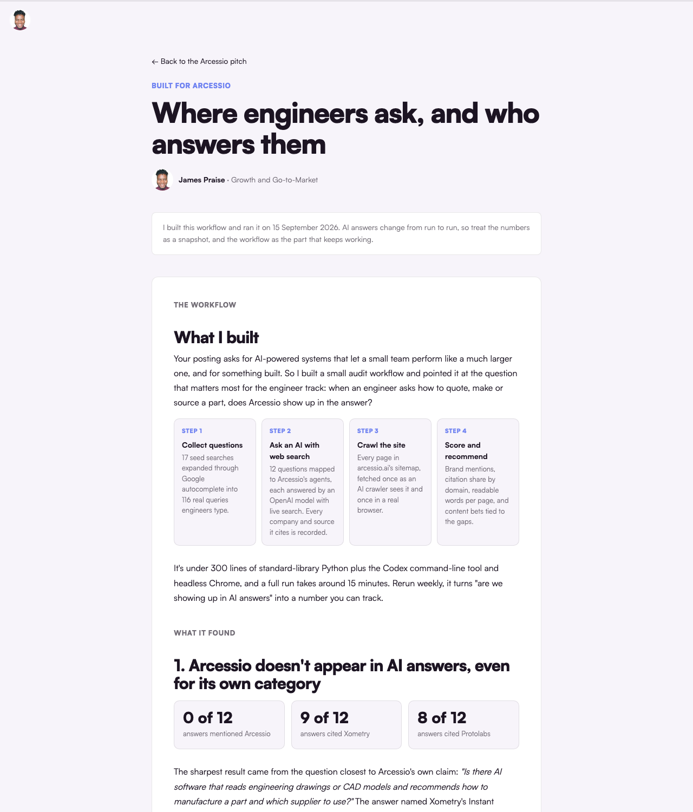

# AI Answer Visibility Audit

A small workflow I built to answer one question for a company: **when its buyers ask an AI assistant a real question, does the company show up in the answer, and can AI crawlers even read its site?**

I built it while applying for a founding growth marketing role at [Arcessio](https://arcessio.ai), an AI company that turns engineering drawings and CAD models into manufacturing decisions. Their job post asked candidates to show something they had built with AI, so instead of describing how I would approach answer engine optimization (AEO), I built the tool and ran it on their market.

---

## What it does

The workflow runs in four steps:

1. **Collect real questions.** Seed searches are expanded through Google autocomplete into the queries buyers actually type. An optional Reddit layer pulls community threads through the Arctic Shift archive.

2. **Ask an AI model with live web search.** Each question goes to an OpenAI model with web search enabled, through the Codex command-line tool. The script records every company the answer names, every source it cites, and whether the target brand appears.

3. **Crawl the site twice.** Every page in the sitemap is fetched once the way a crawler that doesn't run JavaScript sees it, and once rendered in headless Chrome, so you can see how much of the site AI crawlers can actually read.

4. **Summarize.** Brand mentions, citation share by domain, readable words per page, and a markdown report with every answer and source.

It's under 300 lines of standard-library Python, and a full run takes about 15 minutes.

---

## First run: Arcessio (15 September 2026)

| Finding | Result |
|---|---|
| AI answers that mentioned Arcessio | 0 of 12 |
| Answers citing Xometry / Protolabs | 9 of 12 / 8 of 12 |
| Category question ("AI that reads drawings and recommends process and supplier") | The answer named Xometry's Instant Quoting Engine as "the closest match" |
| Sitemap pages showing a non-JavaScript crawler fewer than 25 words | 14 of 15 |
| Words readable without JavaScript vs rendered | 962 vs 10,762 |

The pages that won citations answered one practical question each: cost guides, process comparisons, design for manufacturing (DFM) checklists and help-center pages. Raw results are in [`data/`](data) and the full answer log is in [`output/report.md`](output/report.md).

AI answers change from run to run, so treat one run as a snapshot. Rerun weekly, it becomes a citation-share metric.

---

## How to run it

Requirements: Python 3, [Google Chrome](https://www.google.com/chrome/), and the [Codex CLI](https://github.com/openai/codex) signed in.

1. Edit `config.py`: the decision themes, autocomplete seeds, subreddits and the brand name and domains.

2. Collect questions: `python3 collect.py`. Add `--reddit-only` to rerun just the Reddit layer.

3. Check the site: `python3 site_check.py https://example.com/sitemap.xml`

4. Write the questions to test into `data/ai_questions.json` (theme, question, and the evidence behind it), then run `python3 ai_answers.py`.

5. Group collected questions into themes with `python3 analyze.py`, and build the summary with `python3 report.py`.

| File | Job |
|------|-----|
| `config.py` | Themes, seeds, subreddits, brand |
| `collect.py` | Google autocomplete and Reddit archive collection |
| `ai_answers.py` | Web-searching AI answers, companies and sources |
| `site_check.py` | Raw HTML vs rendered words per sitemap page |
| `analyze.py` | Theme grouping and engagement ranking |
| `report.py` | `data/summary.json` and `output/report.md` |

---

## Limits

- One model per run. Perplexity and Google AI Overviews aren't covered yet.
- Question selection for the AI step is editorial, grounded in the autocomplete evidence.
- The Reddit archive rate-limits heavily, so that layer is optional.

---

## About

Built by [James Praise](https://www.jamespraise.xyz), founder of [Marketing In Action](https://marketinginaction.xyz).

- LinkedIn: [linkedin.com/in/jamespraise](https://www.linkedin.com/in/jamespraise)
- X: [x.com/realjaymes](https://x.com/realjaymes)
